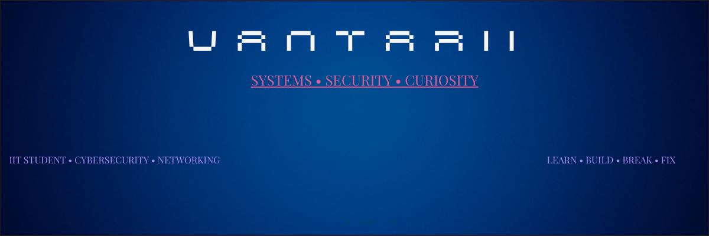

<p align="center">
  
</p>


---

## 👋 Hi, I'm Vantarii

I'm an IT student passionate about **systems, networking and cybersecurity**.

I learn by building things, experimenting in the lab, breaking them, fixing them, and documenting what I discover.

```text
🌱 Currently learning
├── 🐧 Linux & System Administration
├── 🌐 Networking
├── 🔐 Cybersecurity
└── 💻 Web Development

💡 My approach
Learn → Build → Break → Fix → Document → Repeat


---

## 🛠️ Tech Stack

### 🐧 Systems & Networking


## 🧪 My Labs

| Lab | What I practiced | Status |
|---|---|---|
| 🐧 [Ubuntu + OpenSSH](https://github.com/vantarii/ubuntu-installation-and-openssh) | Linux installation, SSH & system configuration | 🟢 Completed |
| 🌐 [Web Project](https://github.com/vantarii/site_gaming) | HTML & CSS | 🟢 Completed |
| 💻 [PHP Forum](https://github.com/vantarii/Forum-en-php) | PHP fundamentals | 🟡 Learning |
| 🧬 [ImmyBloom](https://github.com/vantarii/ImmyBloom) | Web, writing & content management | 🟢 Active |
